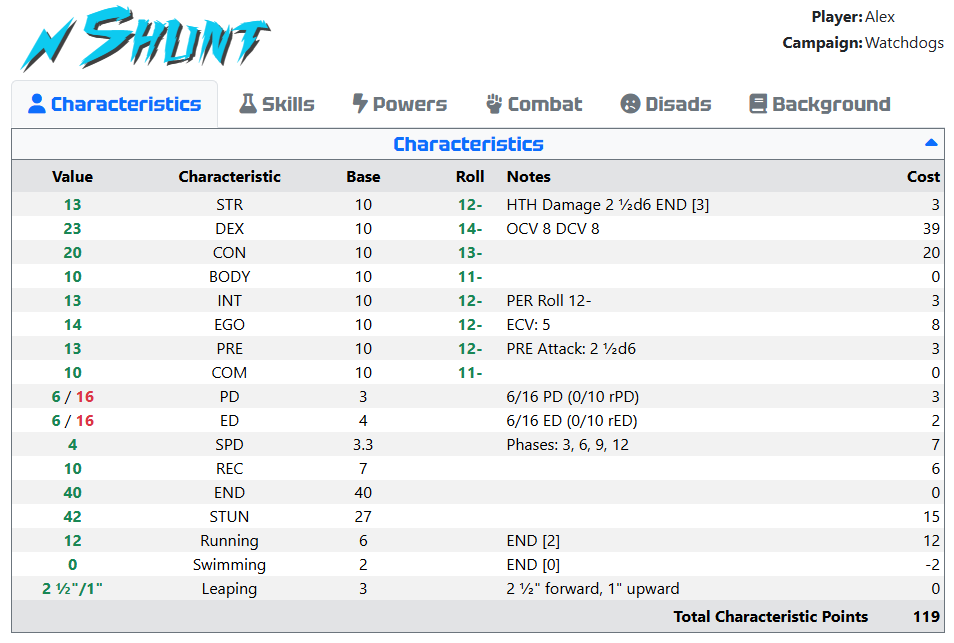
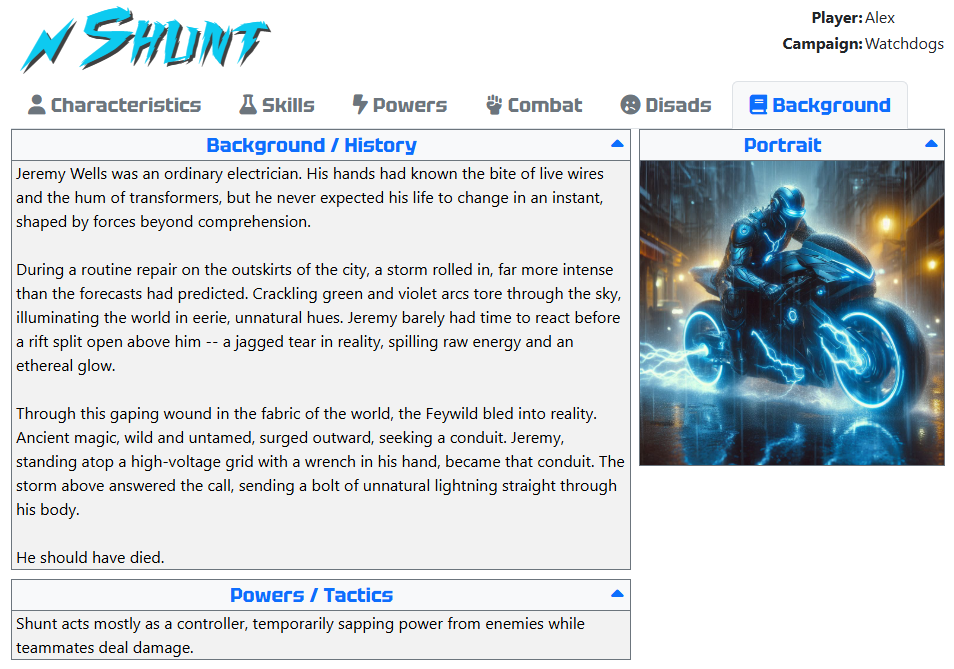
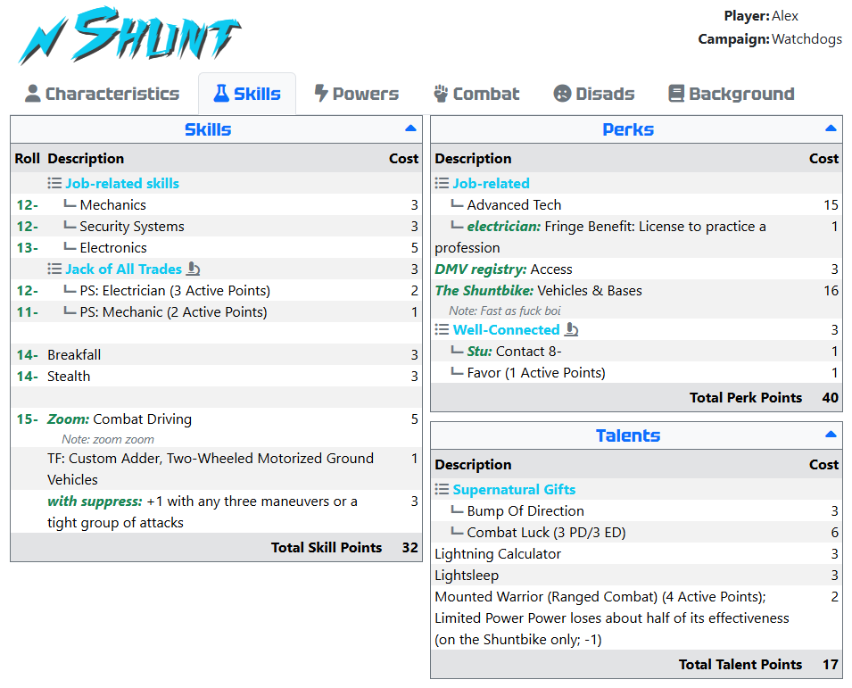
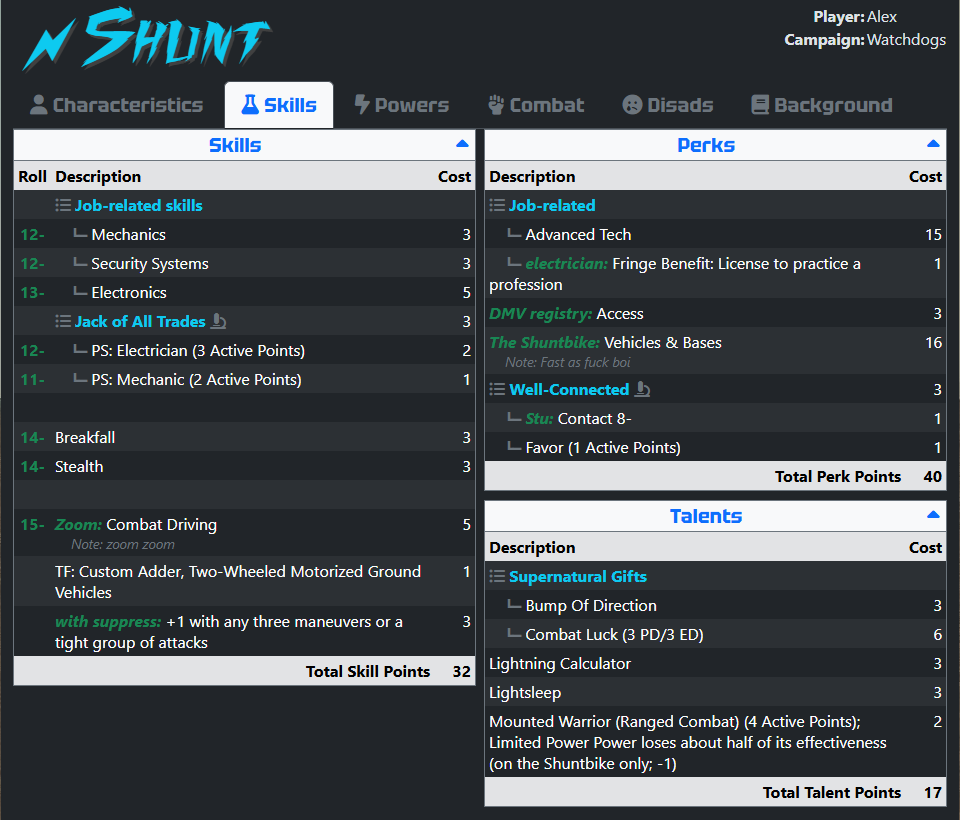
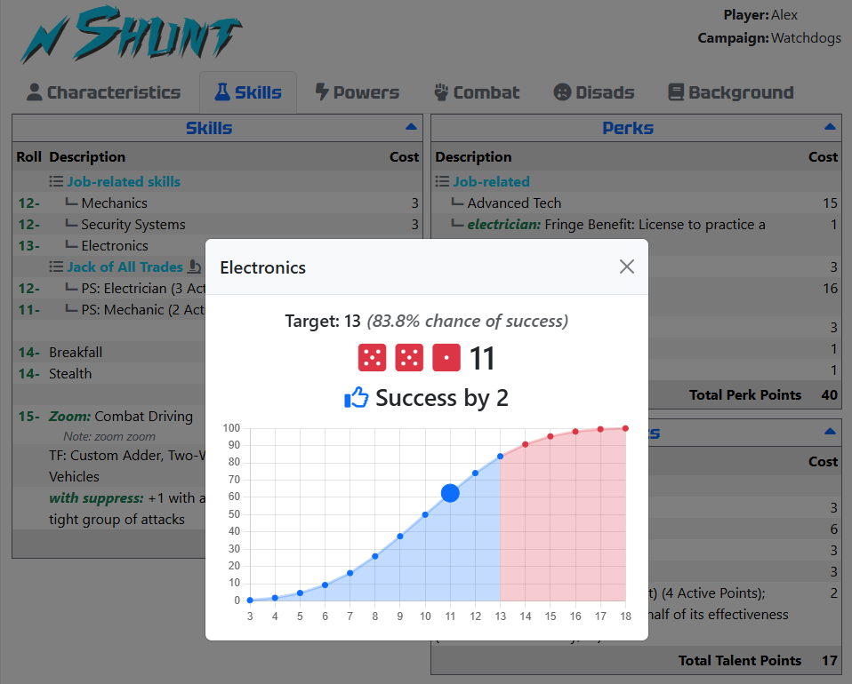
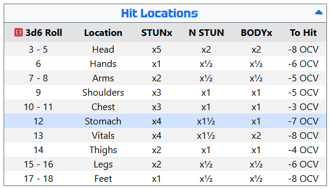
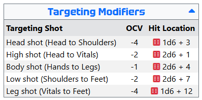
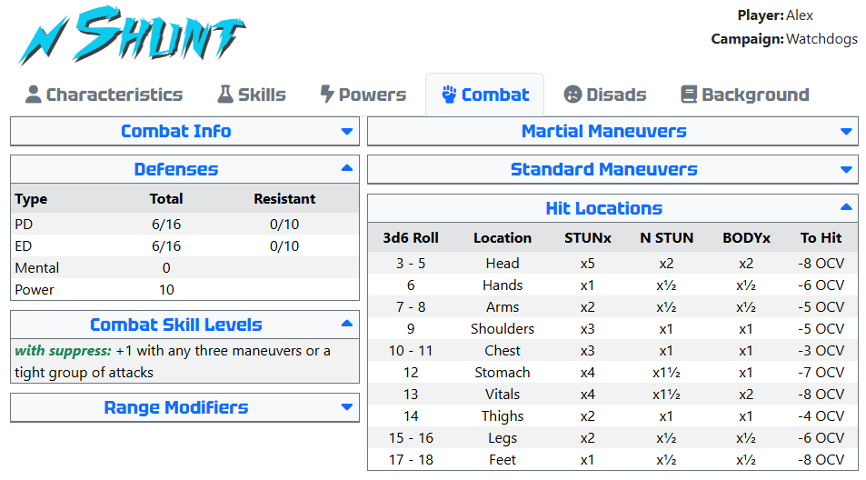

# Ork HERO Templates

This project contains a set of [HERO Designer](https://www.herogames.com/store/product/1-hero-designer/) character export templates with customizable features and active elements, intended for use directly in a browser during a virtual gaming session. These templates should never be used for physical printing or PDF export. The project's top priorities are to maximize use of screen real estate, minimize scrolling, and eliminate the need to have the HERO Designer application open while playing.

## Features

- [Multiple Layouts](#layouts) - choose which best fits your preferred window size
- [Active Tabs](#tabs) - content is always above the fold
- [Embedded Portrait](#embedded-portrait) - no separate image file required
- [Light and Dark Mode](#light-and-dark-mode) - both on the same sheet
- [Integrated Die Roller](#integrated-die-roller) - for most 3d6 rolls
- [Collapsible Blocks](#collapsible-blocks) - hide the panels you don't need
- [Hotkeys](#hotkeys) - keyboard shortcuts for common items
- [Embedded CSS Customization](#embedded-css-customization) - CSS can be stored in the `*.hdc` file and automatically applied on each export

## Live Examples

- [8 x 9](https://alexhowansky.github.io/ork-hero-templates/examples/Azarra-8x9.html)
- [16 x 9](https://alexhowansky.github.io/ork-hero-templates/examples/Azarra-16x9.html)

## Use

* Download the latest `*.hde` template files from the [repository releases page](https://github.com/AlexHowansky/ork-hero-templates/releases) and copy them to your HERO Designer installation directory or wherever you prefer to keep your export templates.
* Launch HERO Designer and load the desired character.
* Select `Current Character` > `Export` > `Set Export Format...`, select the desired template, and click the `Select` button.
* Save the character to make this choice persistent.
* Select `Current Character` > `Export` > `Export to File...` to generate the HTML output.

### Caveats

* The templates use the `Background` > `Campaign Use` field to store metadata. If you are experiencing any rendering issues, try emptying this field and re-exporting.
* HERO Designer does not escape any output. Avoid using any HTML special characters like quotes, ampersands, and less-than signs in your descriptions, names, and notes.

## Features

Ork HERO Templates use JavaScript to render active features in real time.

### Layouts

A layout defines a particular arrangement of display items. There are multiple layouts available, each provided as a separate template file. The informational content of each layout is identical, only the positioning of elements differs.

|File|Description|
|-|-|
|`Ork-16x9.hde`|This layout is designed to fit a maximized window on a 16:9 monitor. It crams as much information onto the screen as possible. It is most useful when you have multiple monitors.|
|`Ork-8x9.hde`|This layout is designed to fit a half-wide window on a 16:9 monitor. It is most useful when splitting multiple windows on one monitor.|

### Tabs

Content is presented on multiple tabs. All data is intended to be visible without scrolling.



### Embedded Portrait

If a portrait image is provided, it will be embedded directly in the HTML file. There is no need to save the portrait image file separately alongside the HTML file. (Note that HERO Designer will still export the portrait image as a separate file. It is not needed.)



### Light and Dark Mode

Both light and dark modes are available on the same sheet. Press `t` to toggle between them.




### Integrated Die Roller

An integrated die roller is available for many 3d6 rolls. Click on the target value in the Roll column to launch the roller.



An integrated die roller is also available for the hit locations block. Click on the red die icon to make a roll. The rolled location will be highlighted in the table for 30 seconds.



This also works for the targeting modifiers block.



### Collapsible Blocks

All blocks are collapsible, and may have their state toggled between open and closed by clicking on the block's title bar.



### Hotkeys

The following hotkeys are supported:

|Key|Feature|
|:-:|-|
|t|Toggle light/dark mode.|
|c|Navigate to the Characteristics tab.|
|s|Navigate to the Skills tab.|
|p|Navigate to the Powers tab.|
|o|Navigate to the Combat tab.|
|d|Navigate to the Disads tab.|
|b|Navigate to the Background tab.|

### Embedded CSS Customization

Various features of this template can be configured from metadata stored in the character sheet itself. This allows for automatic customization of the resulting output, every time it is exported, without the need to subsequently edit the generated HTML file.

This is accomplished by placing [CSS](https://developer.mozilla.org/en-US/docs/Web/CSS) in the `Campaign Use` field on the `Background` tab of your character file. If you wish to make use of this feature, populate the field with _only_ CSS, do not include any `<style>` tags or other information. This CSS will be extracted by the template when the page is generated and will be applied to the resulting HTML. Virtually any part of the template may be targeted. For example, fonts and colors may be changed or individual content blocks hidden.

#### Hiding Blocks

Each content block has a unique id and may be targeted by a CSS selector to apply customizations. These are:

- `#background-appearance-block`
- `#background-block`
- `#background-personality-block`
- `#background-quote-block`
- `#background-tactics-block`
- `#characteristics-block`
- `#combat-info-block`
- `#combat-skill-levels-block`
- `#defenses-block`
- `#disads-block`
- `#hit-location-block`
- `#martial-maneuvers-block`
- `#perks-block`
- `#portrait-block`
- `#powers-block`
- `#range-modifiers-block`
- `#skills-block`
- `#standard-maneuvers-block`
- `#talents-block`
- `#targeting-modifiers-block`

For example, if you do not use hit locations, you may completely hide the associated blocks by placing this CSS in your `Campaign Use` field:

```css
#hit-locations-block, #targeting-modifiers-block {
    display: none;
}
```

#### Changing Fonts and Colors

There are also number of customizable elements named by class. These may be used to target all the associated elements of that type.

|CSS Selector|Target|
|-|-|
|`.ability-name`|Used for custom names for powers, skills, perks, and talents.|
|`.block`|All content blocks.|
|`.block-title`|The title bar at the top of each content block.|
|`.character-name`|The large character name at the top of the page.|
|`.list`|List header items.|
|`.list-item`|List member items.|
|`.nav-link`|The navigation tab buttons.|
|`.note`|Notes for powers, skills, perks, talents, and disads.|
|`.primary`|Primary characteristic values.|
|`.roll`|Values that can be rolled by the integrated die roller.|
|`.secondary`|Secondary characteristic values.|
|`.tooltip`|Hover tooltips.|

The most useful of these customizations is arguably the ability to import web fonts, such as those from [Google Web Fonts](https://fonts.google.com/) and [CDN Fonts](https://www.cdnfonts.com/).

##### Google Web Fonts

Look up a desired font on [Google Web Fonts](https://fonts.google.com/) then click `Get Font`, `Get Embed Code`, and select the `@import` radio. Copy and paste the supplied `@import` CSS line (do not include the `<style>` tags) into the `Campaign Use` field and then add a `font-family` attribute to apply the name of the font to the desired CSS selector. For example, to change the font of your character's name:

```css
@import url('https://fonts.googleapis.com/css2?family=Rubik+Glitch&display=swap');
.character-name {
    font-family: 'Rubik Glitch';
}
```

##### CDN Fonts

Look up a desired font on [CDN Fonts](https://www.cdnfonts.com/) then click its name to zoom to the font detail page. From there, copy the `@import` CSS line (do not include the `<style>` tags) into the `Campaign Use` field and add the `font-family` attribute as desribed above.

```css
@import url('https://fonts.cdnfonts.com/css/vampire-wars');
.character-name {
    font-family: 'Vampire Wars';
}
```

Note that if you import more than one font, all the `@import` statements must be at the top:

```css
@import url('https://fonts.googleapis.com/css2?family=Rubik+Glitch&display=swap');
@import url('https://fonts.googleapis.com/css2?family=Acme&display=swap');
@import url('https://fonts.googleapis.com/css2?family=Delius&display=swap');
.character-name {
    font-family: 'Rubik Glitch';
}
.block-title {
    font-family: 'Acme';
}
.nav-link {
    font-family: 'Delius';
}
```

 You may of course provide any additional valid CSS properties to the provided selectors. You may have to add the `!important` CSS property to some values.

```css
@import url('https://fonts.googleapis.com/css2?family=Rubik+Glitch&display=swap');
@import url('https://fonts.googleapis.com/css2?family=Acme&display=swap');
.character-name {
    color: blue;
    filter: drop-shadow(#404040 0.2rem 0.2rem);
    font-family: 'Rubik Glitch';
    font-size: 4rem;
}
.block-title {
    color: green !important;
    font-family: 'Acme';
}
```

## Development

The templates make use of [Twitter Bootstrap](https://getbootstrap.com/), [Font Awesome](fontawesome.com), and [Chart.js](https://www.chartjs.org/). All resources are loaded dynamically from CDNs. The build process makes use of [PHP](https://php.net/) and [Composer](https://getcomposer.org/).

Source files are separated into chunks according to type so that content-aware IDEs can offer proper tooling. Some string replacement anchors have been replaced with alternatives that are valid comments in the langauge block where they're used, so that they do not break IDE tooling or syntax highlighting.

|File|Contents|
|-|-|
|`page.html`|Common HTML page wrapper for all layouts.|
|`page.css`|Default CSS for the page.|
|`page.js`|JavaScript for active elements.|
|`template.xml`|Common template tags for all layouts.|
|`layouts/*.html`|Layout-specific HTML.|
|`layouts/*.xml`|Layout-specific template tags.|
|`blocks/*.html`|Definitions for HTML blocks that can be arbitrarily positioned in a layout.|

 To assemble the layouts into `*.hde` templates, run:

```sh
./build.php
```

This will create one template per layout, in the `dist` subdirectory. An optional target directory override may be specified:

```sh
./build.php /path/to/template/directory
```

For active continuous development, run:

```sh
./watch.sh /path/to/template/directory
```

This will start a process that monitors all the source files and automatically runs the build process when any change is
detected.
